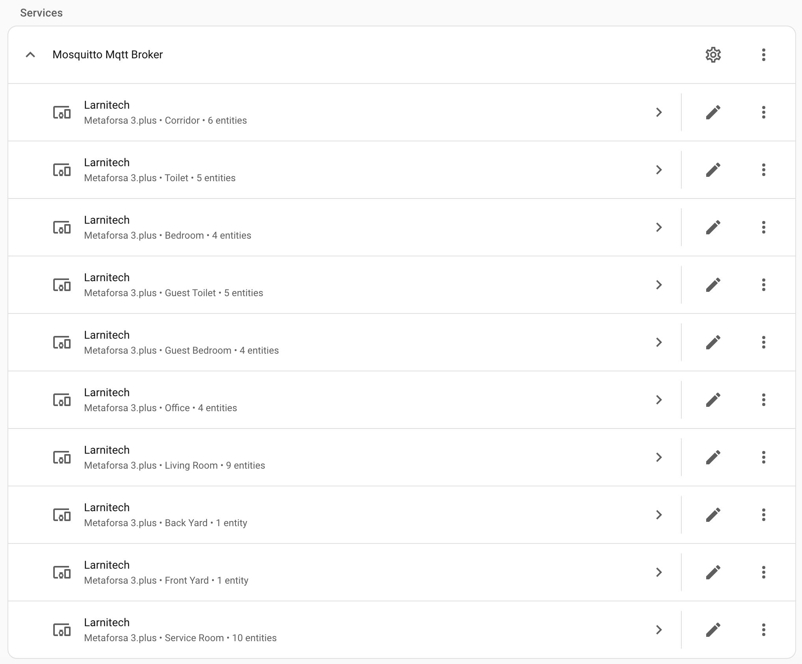
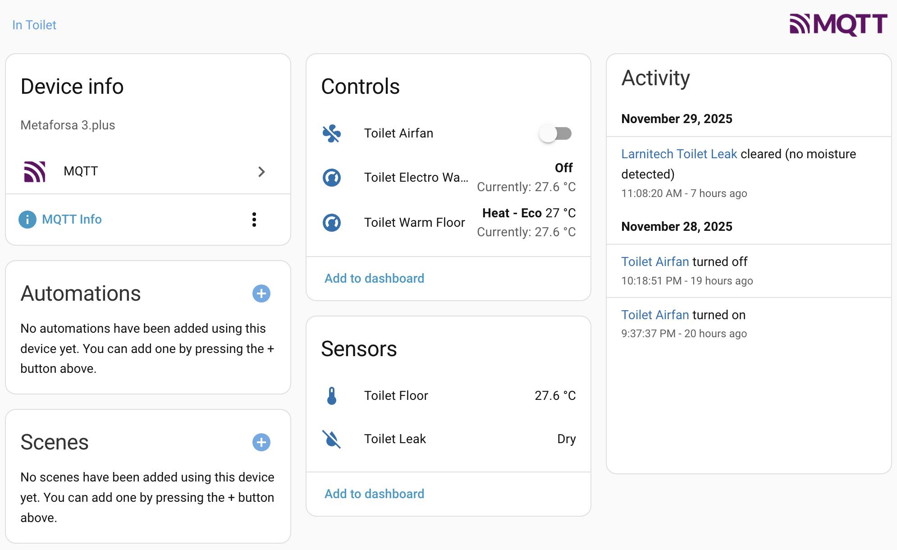
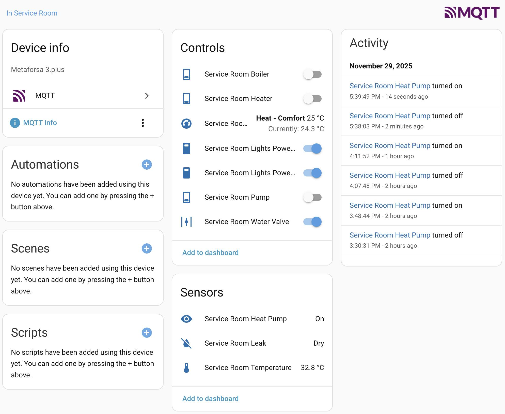

# Larnitech to Home Assistant Bridge

This software lets you forget about the Larnitech app and transfer your smart home Larnitech controls to Home Assistant, unifying everything in a single place.

The supported device types can be found [here](src/lt2ha/device/__init__.py).

> [!TIP]
> - It is crucial to correctly set device's subtype in the Larnitech app. I.e. a `script` that controls the air fan must be set to `air-fan`.
> - Ensure areas in Larnitech and Home Assistant are named the same. Otherwise, areas with the Larnitech's names will be automatically added to HA potentially causing duplication.

## Requirements

### Hardware

- Any Larnitech hub with the [API2](https://wiki.larnitech.com/API2) support.
- A Home Assistant installation that supports addons or any device(s) capable to host the MQTT broker and the bridge.

### Software

- Home Assistant.

## Installation

1. [](https://my.home-assistant.io/redirect/supervisor_add_addon_repository/?repository_url=https%3A%2F%2Fgithub.com%2FBR0kEN-%2Flt2ha)
2. Install & configure.
3. Turn on `Autoupdate` & `Watchdog`.
4. Start and check logs to ensure it's running.

### Run as a Systemd service

This is an alternative usage method. Stick to it only if you know why you're going this way!

1. ```bash
   cd /usr/local/share
   git clone git@github.com:BR0kEN-/lt2ha.git
   cd lt2ha
   pip3 install -e . --break-system-packages --no-cache-dir
   ```
2. Add `/etc/systemd/system/lt2ha-bridge.service`. Ensure the parameters.
   ```ini
   [Unit]
   Description=Larnitech Bridge
   After=network.target

   [Service]
   ExecStart=lt2ha-bridge larnitech-bridge --ha-mqtt-discovery-prefix homeassistant --mqtt-host 127.0.0.1 --mqtt-port 1883 --mqtt-username 'mosquitto' --mqtt-password 'heyiampassw0rd' --mqtt-proto 4 --mqtt-transport tcp --lt-host 192.168.68.55 --lt-port 2041 --lt-key 'heyiamanapikey' --lt-ign
   ore-area Setup --lt-ignore-type com-port
   Restart=always
   RestartSec=5
   StandardOutput=journal
   StandardError=journal

   [Install]
   WantedBy=multi-user.target
   ```
3. Enable the service, reload the daemon, and you're good to go.

## Screenshots






## Notes

- Renaming/removing an entity in Larnitech would not be reflected in HA. Though, once done, restart the bridge and reload an MQTT. Then adjust the HA entity manually.

## Disclaimer

This software is provided as is without any express or implied warranties. The author is not responsible for any damage or data loss. Use at your own risk.
